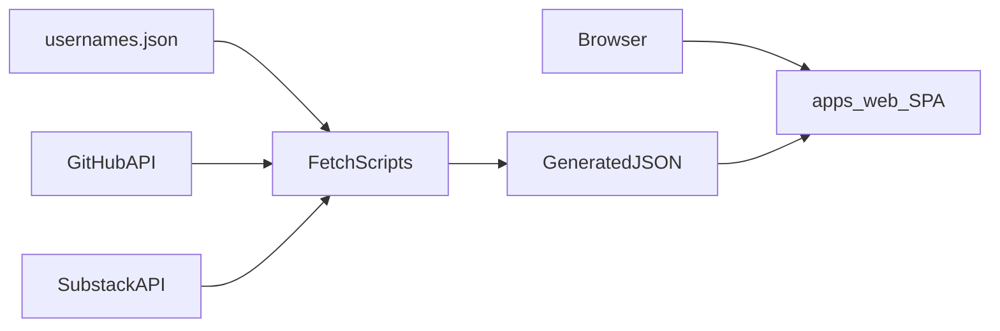
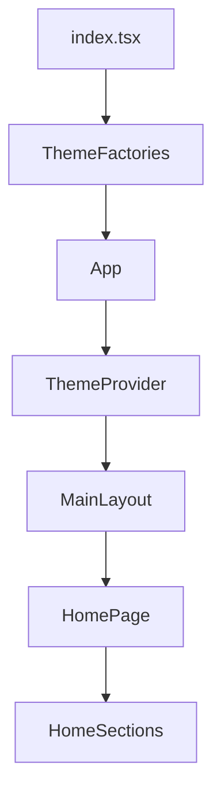
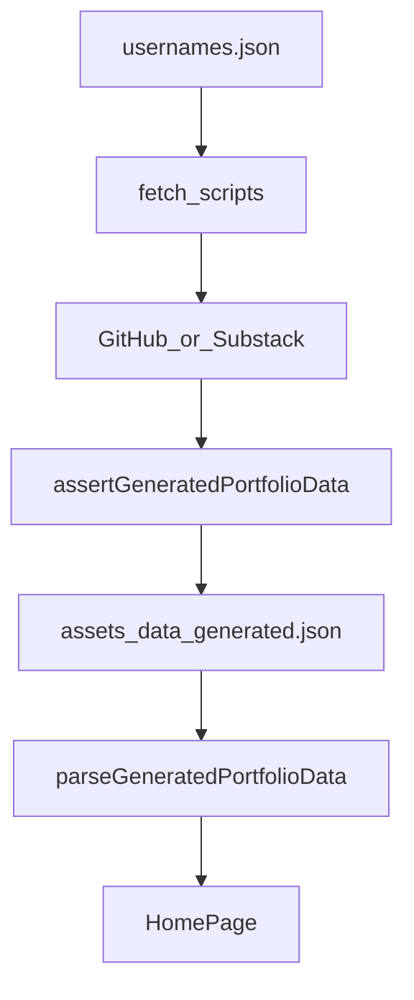
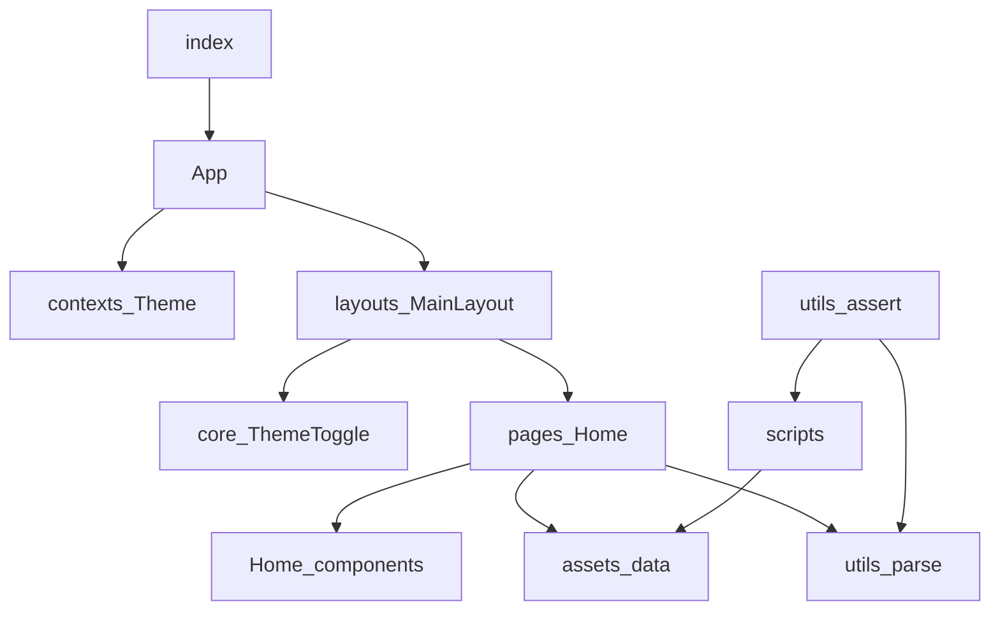

# Portfolio architecture

This document gives the high-level system architecture of the portfolio monorepo.

## Purpose and scope

The repo ships a **static portfolio SPA** for Dean Grant.
Content is mostly constants plus **build-time** GitHub and Substack JSON.
There is no runtime API server.

This file covers:

- System context and package shape
- Runtime composition of the web app
- Build-time data pipeline
- Module map and theme dependency injection
- UI surface at section level
- Tooling, agent layout, and verification commands

This file does **not** cover:

- Getting started and human scripts — see [README.md](../../README.md)
- Agent index and day-to-day conventions — see [AGENTS.md](../../AGENTS.md)
- Visual tokens, typography, and UI patterns — see [DESIGN.md](DESIGN.md)
- App-specific edit rules — see [portfolio-web](../skills/portfolio-web/SKILL.md) and [reference.md](../skills/portfolio-web/reference.md)
- Folder-layer and SOLID/JSDoc skills under [`.agents/skills/`](../skills/)

## System context

The browser loads a Vite-built React app from [`apps/web`](../../apps/web).
Node fetch scripts run at `predev` / `prebuild` (and in CI lint) to refresh generated JSON under `src/assets/data/`.
The SPA reads that JSON at build/bundle time; it does not call GitHub or Substack from the client.

Stack: Node `>=22`, pnpm `11.8`, React 19, Vite, TypeScript, Biome, React Doctor.



## Runtime composition

[`apps/web/src/index.tsx`](../../apps/web/src/index.tsx) mounts React and creates concrete theme adapters.
[`App.tsx`](../../apps/web/src/App.tsx) accepts those adapters and wires providers around the page.

1. Create `ThemeApplicator` and `ThemeStorage`.
2. Render `App` with those props.
3. `ThemeProvider` applies and persists theme.
4. `MainLayout` hosts the theme toggle and content column.
5. `HomePage` renders portfolio sections.

A blocking script in [`apps/web/index.html`](../../apps/web/index.html) sets `data-theme` from `localStorage` before paint (FOUC guard).
The storage key must match `THEME_STORAGE_KEY`.



## Build-time data pipeline

Usernames live in [`apps/web/src/assets/usernames.json`](../../apps/web/src/assets/usernames.json).
Thin `*.constants.ts` files re-export handles for social links and scripts.

Scripts:

- [`fetch-github-projects.mjs`](../../apps/web/scripts/fetch-github-projects.mjs)
- [`fetch-substack-articles.mjs`](../../apps/web/scripts/fetch-substack-articles.mjs)

Flow:

1. Read username (JSON or env override).
2. Call the remote API (timeouts; optional `GITHUB_TOKEN`).
3. Map and validate with [`assertGeneratedPortfolioData.mjs`](../../apps/web/src/utils/assertGeneratedPortfolioData.mjs).
4. Write `apps/web/src/assets/data/*.generated.json`.

At runtime, [`Home/index.tsx`](../../apps/web/src/pages/Home/index.tsx) imports the JSON and validates again via [`parseGeneratedPortfolioData.ts`](../../apps/web/src/utils/parseGeneratedPortfolioData.ts).

Soft-fail: if a fetch fails and a prior usable generated file exists, the script can keep it and exit successfully so local/CI work can continue on stale data.
Do not hand-edit generated JSON.



## Module map

Workspace packages: `apps/*` only. The product UI is `web`.

| Area | Role |
| ---- | ---- |
| `src/index.tsx` | Entry; inject theme concretes |
| `src/App.tsx` | Composition root |
| `src/pages/Home/` | Single page + page-local sections |
| `src/components/core/` | Shared leaf UI (`ThemeToggle`) |
| `src/components/layouts/` | Page shell (`MainLayout`) |
| `src/contexts/` | `ThemeProvider` |
| `src/hooks/` | Shared hooks (`useTheme`) |
| `src/constants/` | Portfolio copy and channel re-exports |
| `src/assets/` | `usernames.json` and generated data |
| `src/utils/` | Theme adapters, parse/assert helpers |
| `src/types/` | Shared portfolio and theme types |
| `src/styles/global.css` | CSS variables, base styles, reduced-motion |
| `scripts/` | Build-time fetchers |

Empty `patterns/`, `containers/`, `routes/`, `services/`, `stores/`, and `i18n/` folders are intentionally absent until needed.



## Theme DIP

Contracts in [`theme.types.ts`](../../apps/web/src/types/theme.types.ts):

- `ThemeStorage` — read/write preferred theme
- `ThemeApplicator` — write `data-theme` on the document

Concretes: [`themeStorage.ts`](../../apps/web/src/utils/themeStorage.ts), [`themeApplicator.ts`](../../apps/web/src/utils/themeApplicator.ts).
Create them only at the composition edge (`index.tsx`).
`ThemeToggle` is presentational; `MainLayout` bridges `useTheme`.

Visual tokens live as CSS variables on `:root` / `[data-theme]` in `global.css`.
Components use `var(--…)` and CSS Modules.

## UI surface

One route: Home. Sections under `pages/Home/components/`:

| Section | Role |
| ------- | ---- |
| `HeroSection` | Name and tagline |
| `SocialLinks` | Channel links and icons |
| `ProjectsSection` | Sorted horizontal carousel of GitHub projects |
| `ProjectCard` | Project card + topic overflow |
| `ArticlesSection` / `ArticleItem` | Substack article list |
| `SiteFooter` | Footer |

Projects and articles sections gate on non-empty parsed lists.
Carousel scroll and sort helpers colocate with `ProjectsSection`.

## Tooling and agent layout

| Concern | Mechanism |
| ------- | --------- |
| Format / lint | Biome |
| React diagnostics | React Doctor (`pnpm run doctor*`) |
| Typecheck | `pnpm run typecheck` |
| CI | Lint (fetch + Biome + lockfile + React Doctor), typecheck, audit |

Agent support lives under [`.agents/`](../):

- `docs/` — this architecture file
- `rules/` — always-on and glob rules
- `commands/` — `/doctor`, `/check`, `/fetch-data`, `/new-component`
- `hooks/` — Biome and React Doctor after file edit
- `skills/` — portfolio-web, structure, SOLID, JSDoc, react-doctor

Cursor loads rules/commands via symlinks from `.cursor/` into `.agents/`.
[`.cursor/hooks.json`](../../.cursor/hooks.json) invokes `.agents/hooks/*`.

See [AGENTS.md](../../AGENTS.md) for the full index.

## Verification

Local checks aligned with CI expectations:

```bash
pnpm exec biome ci
pnpm run typecheck
pnpm run doctor:changed
```

Optional data refresh:

```bash
pnpm --filter web fetch:projects
pnpm --filter web fetch:articles
```
